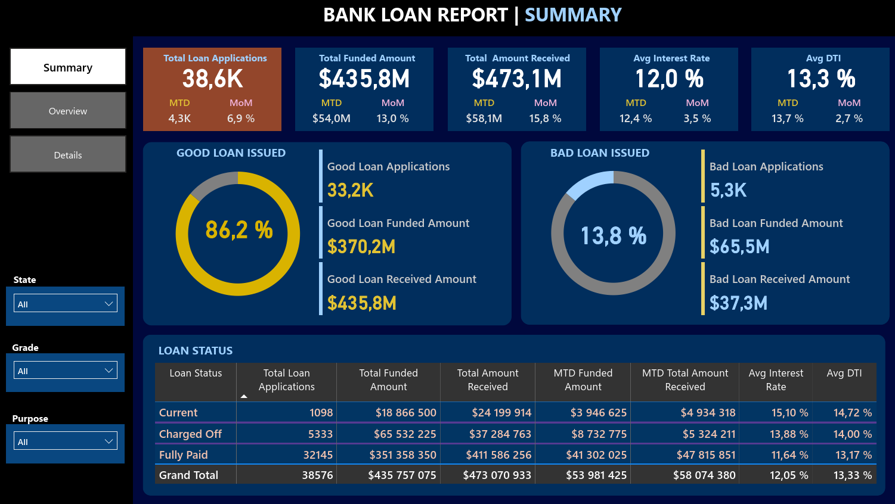
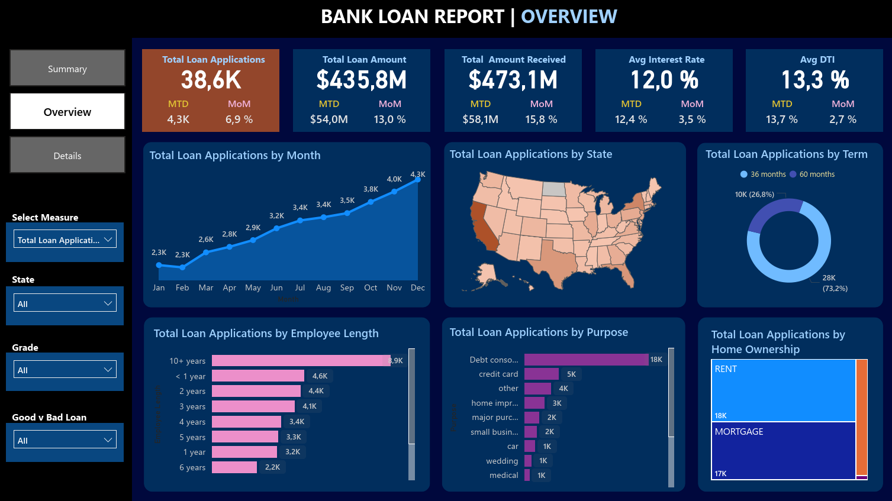
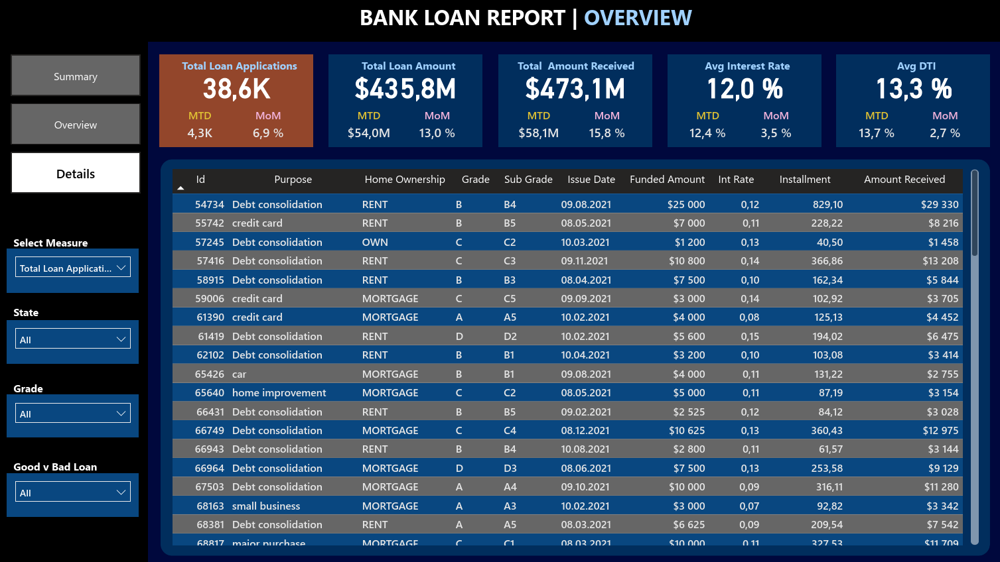

# Project: Bank Loan Dashboard

## Problem
A personal loan company needed a clear, interactive way to track and analyze its loan portfolio. With a large volume of applications and funded amounts, management lacked an efficient tool to monitor key metrics and trends over time.

## Solution
I built an interactive Power BI dashboard that gives management a complete overview of the loan portfolio, including total applications, funded amounts, received payments, interest rates, and DTI (Debt-to-Income) ratio. The dashboard supports trend analysis over time, month-to-date and month-over-month comparisons, and breakdowns by loan status, term, purpose, employment length, and home ownership. SQL was used for the underlying data analysis prior to building the report.

## Tech Stack
- SQL
- Power BI
- DAX functions: SUM, COUNT, IF, AVERAGE, TOTALYTD, TOTALMTD, CALCULATE, SAMEPERIODLASTYEAR, CONCATENATE, DATESMTD, DATEADD

## Dataset
- Source: bank_loan_data.csv
- Size: 38,576 records

## Process
1. **SQL analysis** – queried the raw loan data to validate and prepare it for reporting.
2. **KPI design** – defined the core KPIs required by management:
   - Total Loan Applications (with MTD and MoM changes)
   - Total Funded Amount (with MTD and MoM changes)
   - Total Amount Received (with MTD and MoM changes)
   - Average Interest Rate (with MTD and MoM changes)
   - Average Debt-to-Income Ratio (with MTD and MoM changes)
3. **Loan status table** – built a summary table showing total applications, funded amount, received amount, MTD figures, average interest rate, and average DTI by loan status.
4. **Visualizations**:
   - Monthly trends by issue date, to reveal seasonality and long-term lending trends
   - Loan term analysis, to understand the distribution of loans by repayment length
   - Employee length analysis, to assess how applicants' job history relates to loan metrics
   - Loan purpose breakdown, to understand the main reasons behind loan applications
   - Home ownership analysis, to see how home ownership status affects applications and approvals

## Results
The dashboard gives management an at-a-glance view of loan portfolio performance and surfaces seasonal and behavioral patterns that were not previously visible, such as differences in loan metrics by employment length, home ownership, and loan purpose.

## Screenshots / Demo

## How to run
1. Open `Bank Loan Dashboard.pbix` in Power BI Desktop.
2. Refresh the data connection to `bank_loan_data.csv` if needed.
3. Review the accompanying PDFs for the underlying SQL queries and the step-by-step build process.

## Files
- [CSV](bank_loan_data.csv) – dataset
- [PDF](Bank%20Loan%20Dashboard%20SQL%20queries.pdf) – SQL query analysis
- [Power BI report](Bank%20Loan%20Dashboard.pbix) – the Bank Loan Dashboard in Power BI

## Business value
The dashboard gives management an immediate, up-to-date view of loan portfolio performance, helps uncover seasonal trends and regional or behavioral differences, and supports faster, more data-driven decision-making across the lending business.
